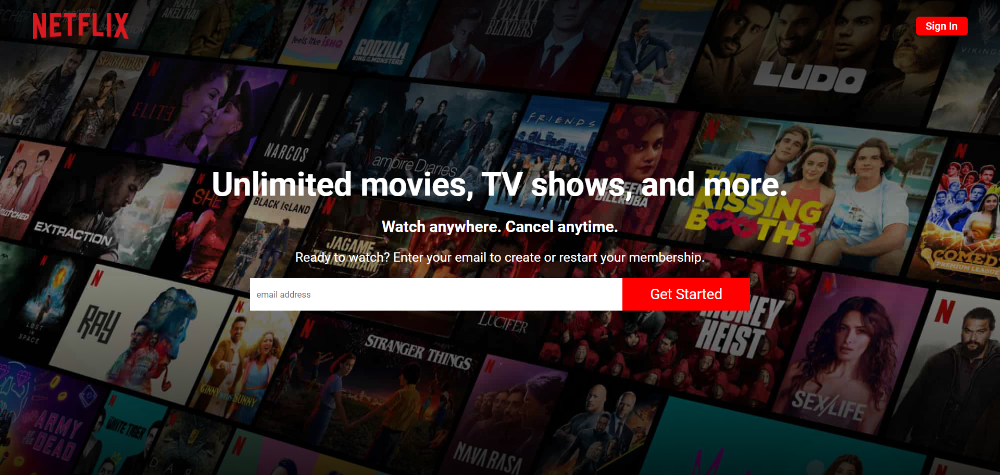
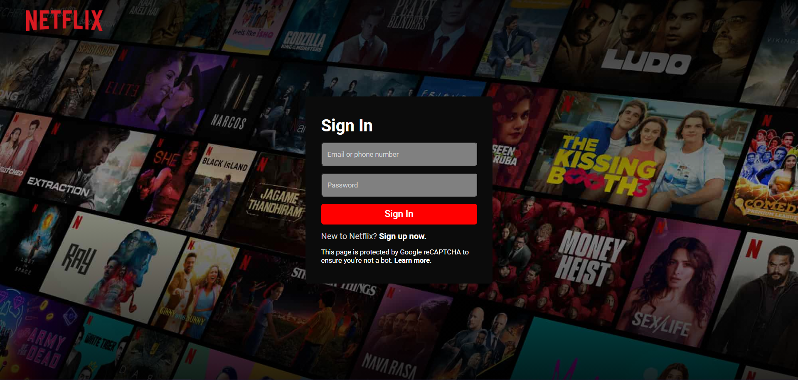
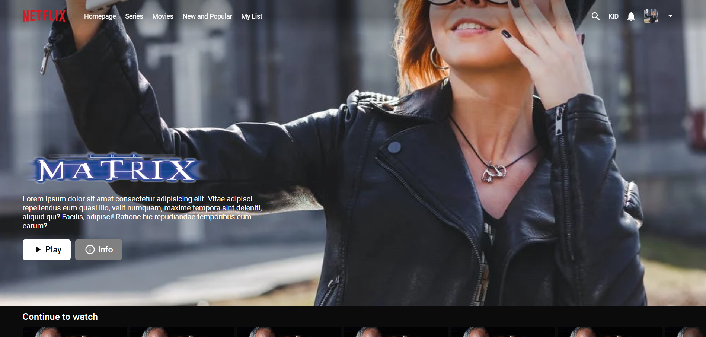
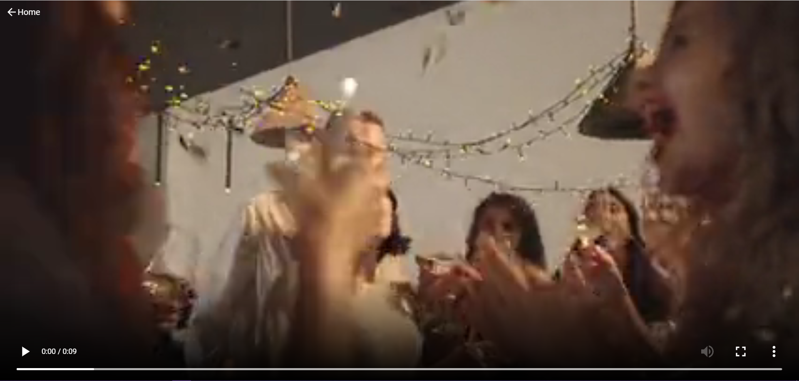

# Netflix Clone
<!-- ABOUT THE PROJECT -->
## About The Project
Netflix Clone build using MERN stack.
- Front_End using React JS completed
- Back-End development pending
### Built With MERN
* [MongoDB](https://www.mongodb.com/) - Database (Pending)
* [Express JS](https://expressjs.com/) - Creating Rest End Point (Pending)
* [React JS](https://reactjs.org/) - Front End 
* [Node JS](https://nodejs.org/en/) - Back End (Pending)

 

<!-- GETTING STARTED -->
## Getting Started
### Prerequisites
1. Node JS
2. NPM
3. React JS

### Client - steps to start client side
1. run command ** npm install** to install required modules
2. to start server use command **npm start**

### Frontend Screenshots

